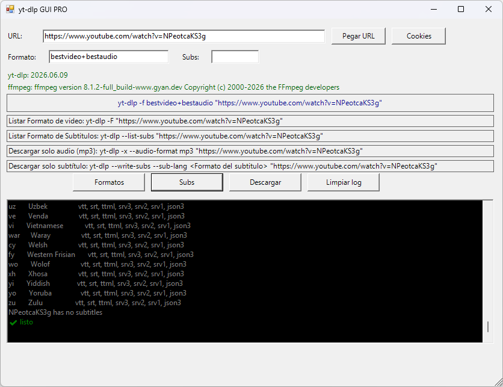

# yt-dlp GUI PRO

**Última Actualización:** 14 de julio de 2026

Interfaz gráfica para **yt-dlp** desarrollada en PowerShell con Windows Forms. Permite descargar videos, audio o subtítulos mediante una interfaz sencilla, mostrando además los comandos generados automáticamente y el registro en tiempo real.



## 📖 Descripción

**yt-dlp GUI PRO** es una interfaz gráfica para **yt-dlp** orientada a facilitar las descargas sin necesidad de escribir comandos manualmente.

El programa permite seleccionar distintos modos de descarga, configurar formatos, subtítulos, cookies, carpeta de destino y muchas otras opciones desde una única ventana.

Además genera automáticamente el comando equivalente de **yt-dlp**, permitiendo copiarlo con un solo clic para utilizarlo posteriormente desde la consola.

---

# 📥 Requisitos

Antes de usar el programa debes tener instalado:

```powershell
winget install Microsoft.PowerShell
```

```powershell
winget install yt-dlp
```

```powershell
winget install Gyan.FFmpeg
```

El programa detecta automáticamente si **yt-dlp** y **ffmpeg** están disponibles.

---

# ✨ Características

- 🎬 Descarga videos con yt-dlp mediante interfaz gráfica.
- 🎧 Descarga únicamente el audio.
- 📹 Descarga únicamente el video.
- 📝 Descarga únicamente subtítulos.
- 🌍 Soporte para múltiples idiomas de subtítulos.
- 🤖 Descarga subtítulos automáticos de YouTube.
- 🍪 Soporte para archivos de cookies.
- 🗑 Permite olvidar las cookies con un clic.
- 📋 Botón para pegar la URL desde el portapapeles.
- 📂 Selección automática o manual de carpeta de destino.
- 📦 Conversión del contenedor final (MP4, MKV, WEBM, AVI u Original).
- 🎵 Conversión del audio a MP3, M4A, WAV, OPUS o formato original.
- 📑 Formato de video completamente editable.
- 🔍 Selector manual del formato de yt-dlp.
- 📄 Visualización de la versión instalada de yt-dlp.
- 🎞 Visualización de la versión instalada de ffmpeg.
- 🖥 Registro de salida en tiempo real.
- 🎨 Log con colores para distinguir mensajes y errores.
- 📋 Copiar automáticamente el comando principal generado.
- 📋 Copiar comandos auxiliares con un clic.
- 🚀 Ejecución asíncrona sin bloquear la interfaz.
- 🔒 Deshabilita automáticamente los botones durante una descarga.
- 📌 Opción "Siempre visible" (Always On Top).
- 💬 Tooltips explicativos para prácticamente todas las opciones.

---

# 🖥️ Uso

1. Introduce la URL del video o playlist.
2. (Opcional) Carga un archivo de cookies.
3. Selecciona el modo de descarga.
4. Configura formato, subtítulos y carpeta de destino.
5. Pulsa **Descargar**.

Durante la descarga podrás seguir viendo el progreso en tiempo real desde el registro inferior.

---

# 🎬 Modos de descarga

El programa incluye cuatro modos:

- 🎥 Video + Audio (normal)
- 📹 Solo video
- 🎧 Solo audio
- 📝 Solo subtítulos

Al cambiar de modo, la interfaz habilita únicamente las opciones compatibles con la operación seleccionada.

---

# ⚙️ Opciones disponibles

Puede configurarse:

- Calidad de video.
- Selector de formato personalizado.
- Conversión del contenedor.
- Formato de audio.
- Idioma de subtítulos.
- Subtítulos automáticos.
- Cookies.
- Carpeta de salida.
- Nombre automático del archivo mediante yt-dlp.

---

# 📋 Comandos rápidos

La aplicación genera automáticamente varios comandos útiles:

- 🎬 Listar formatos disponibles.
- 📝 Listar subtítulos disponibles.
- 🎧 Descargar únicamente audio.
- 📄 Descargar únicamente subtítulos.

Todos pueden copiarse al portapapeles haciendo clic sobre ellos.

---

# 📂 Carpeta de salida

El programa permite trabajar de dos maneras:

- 📁 Automática (misma carpeta del script).
- 📂 Carpeta personalizada seleccionada por el usuario.

---

# 🍪 Cookies

Para sitios que requieren autenticación, es posible cargar un archivo de cookies compatible con **yt-dlp**.

Las cookies pueden activarse o eliminarse desde la interfaz sin reiniciar la aplicación.

---

# 🖥️ Registro en tiempo real

La consola integrada muestra:

- Inicio de cada operación.
- Salida completa de yt-dlp.
- Advertencias.
- Errores.
- Finalización de la descarga.

Todo sin bloquear la ventana principal.

---

# 📄 Tecnologías utilizadas

- PowerShell
- Windows Forms
- yt-dlp
- ffmpeg

---

# 📄 Licencia

Este proyecto se distribuye bajo la licencia **MIT**.

Consulta el archivo **LICENSE** para más información.
